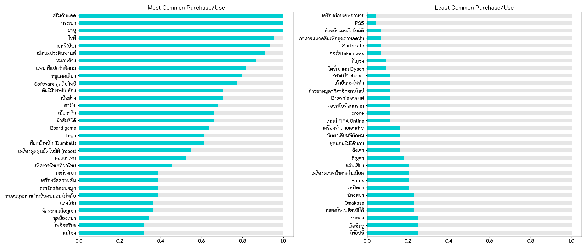
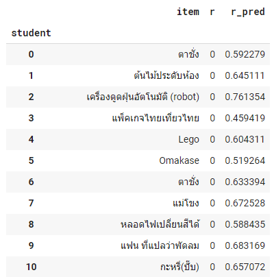

# Product Recommendation

## Dataset 📊  
A survey asking whether or not the user (students from the class) has ever purchased/used an item. We received 44 responses, and each respondent rated each item from 60 items as Yes or No.

**Notebooks:** [Product recommendation](./hw07-product-recommendation.ipynb)  
**Google Colab:** [Open in Colab](https://colab.research.google.com/drive/1PwHrh518AA3rce4Y7xBDahSHvUo1WwpC?usp=sharing)

## Top Most/Least common items
To see how common (ever purchased by users) each item is.

## Association Rules
Running a market basket analysis. Here's the visualzation of 1-itemset association rules (filtered by support > 0.5 and lift > 1.05).

## Collaborative Filtering - Item Similarity
By using users' ratings for each item as its feature vector, cosine similarity values are calculated for each pair of items.  
We can recommend items based on item similarity.

## Matrix Factorization
Using NMF to decompose the Utility Matrix, we then get the mapping of user and item to the concepts in latent space. Both user and items can be visualized in the same Latent space as the chart below. Similar items/users are close to each other.

Reconstruct the decomposed matrices (user & item matrices) gives the predicted rating. In this case, I recommend an item with the highest predicted rating score for each user.  

