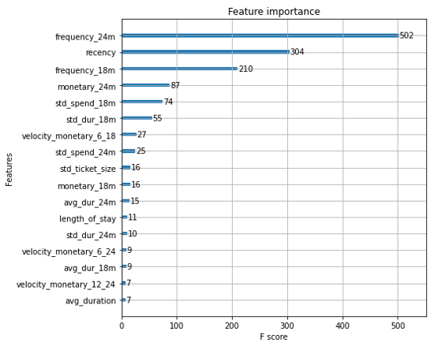

# Campaign Response Model
      

## Dataset 📊  
A Retail-like dataset consisting of CUSTOMER_ID, TRANS_DATE, TRANS_AMOUNT which is on customer's basket level.  

**Notebooks:** [Campaign Response Model](./hw08-campaign-response-model.ipynb)  
**Google Colab:**   

## What I did
More feature engineering, such as
* Tenure, Length of stay
* Time to event
* Monetary, Frequency, Ticket Size, Time to event for the past 6, 12, 18, 24 months
* Velocity of spending for the short period over longer period, e.g, 12 over 24 months

## Cohort Analysis

## Result

## Feature Importance

## SHAP Tree Explainer

## Future Improvements
* Proper model evaluation by using train, validation, and test split including cross validation.  
an expert suggests that this seems overfitting to the test-set
* SHAP Tree Explainer interpretation
* Proper Feature Selection
* Hyperparamter tuning, maybe Optuna
