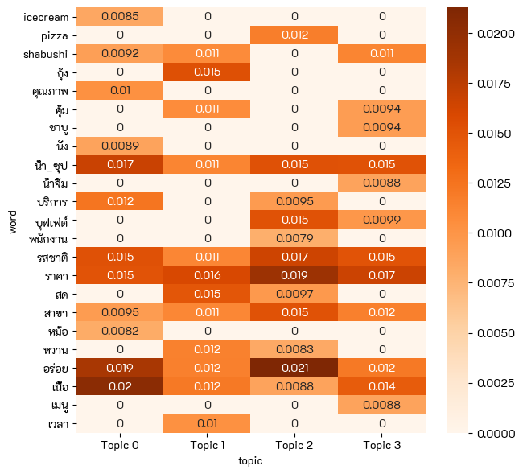
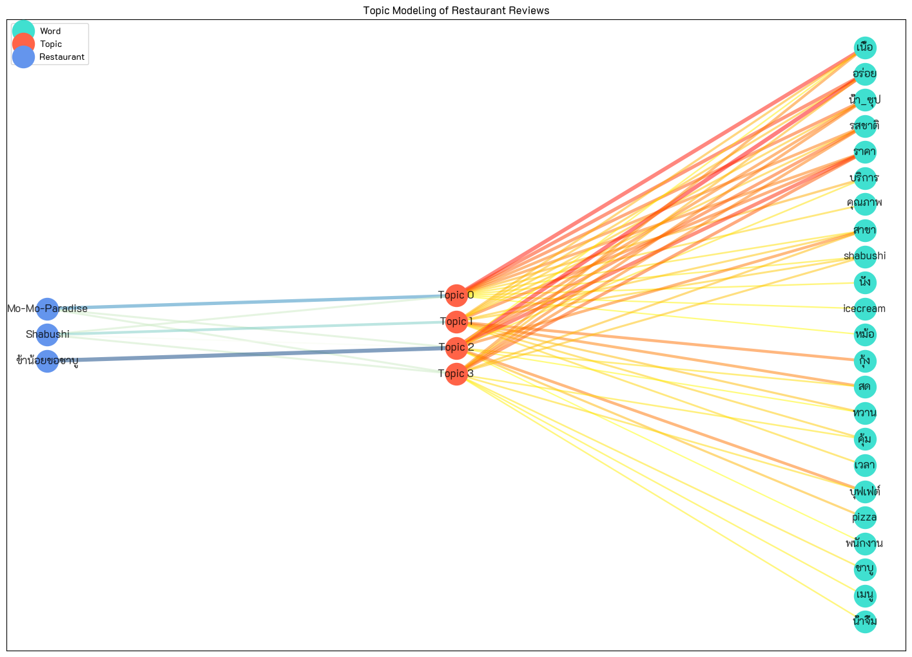

# Voice of Customers
      

## Dataset 📊  
Customer reviews of 3 restaurants from Wongnai - only 21 instances.  

**Notebooks:** [Voice of Customers](./hw11-voice-of-customers.ipynb)  
**Google Colab:**   

## Text Preprocessing
* Correct typos
* Remove special characters and numbers
* Combine Headline + Review content
* Sentence and Word tokenization (using `pythainlp` and `sefr_cut` packages)
* Remove stop words and some cherry-picked words

## Topic Modeling
Choose number of topics = 4  

## Result
Topics and top 12 words.  
  

Number of reviews for each pair of restaurant and topic.  
  

Topic Modeling using graph visualization.  
  
